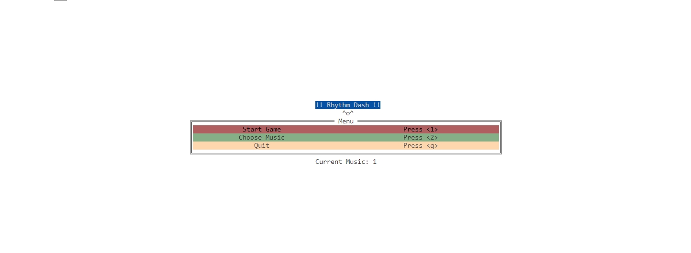

# CSE230-Project

## Rhythm Dash: The Haskell Rhythm Game
### Introduction
Rhythm Dash is a rhythm game built with Haskell and the brick library.

### Project Collaborators

| Name             | GitHub Account         |
|------------------|------------------------|
| Yimeng Wang      | yyyyyymmm              |
| Luyao Ma         | luyaomacs              |
| Ruoyang Li       | koichi-domoto          |
| Kerong Xiang     | chloe020624@gmail.com  |

### Gameplay
As the background music plays, notes aligned with the rhythm will flow from the right towards the judgment points on the left. Players interact by pressing corresponding keys at the precise moment to get a high score. Additionally, Players must maintain their blood level, which depletes when missing hitting. The game incorporates special items, like the "Double" power-up, which doubles the score for a limited time (we call it "bonus time"). And the blood-level-restoring items, which replenish the player's blood level. Players need to keep their blood level from emptying, or else they will lose the game.

### Core Features
- Synced notes with background music.
- Special in-game items to boost scores and replenish blood level.
- Real-time scoring that reflects the accuracy of player interactions.

### Goals
- Display the start screen and game menus.
- Load and play background music.
- Display flowing notes that aligned with the rhythm.
- Implement user interface with multiple keys for hitting notes and getting special items.
- Implement real-time scoring system with immediate feedback.
- Show final scores and other performance metrics in the result page.

### Further Goals
- Introduce varied note types, such as short and long presses, with combo sequences.
- Incorporate different difficulty levels and song options.
- Develop local multiplayer mode or networked multiplayer mode.

### Implementation Roadmap
- UI Development: Use the brick library to create the start screen, note rows, note graphics, current score display, hit feedback, and the results page.
- Game Logic: Integrate music playback, note generation in sync with the rhythm, and score computation based on player actions.
- Testing: Perform unit testing for each component to ensure reliability and performance.
- Extended Features: Implement further goals, refine features, and conduct comprehensive testing.
- Finalization: Complete the project with thorough documentation and prepare for the final presentation and demonstration.

## Updates

### Architecture of Application

- `Sound`: Engaging background music that accompanies the game-play experience.
- `Graphics`: Dynamic notes appearing in sync with the rhythm.
- `Interaction`: The player's score dynamically updates as they press corresponding keys on the keyboard.

### Challenges and Solutions

So far, we have set up the basic framework of the whole program. With the background music playing, notes that are synchronized with the rhythm flow from the right to the judgment point on the left. Players strive to achieve high scores by accurately pressing the corresponding keys at the right moment.

Though the challenge is that we need to accelerate the pace of our progress, we still think we are able to achieve the basic functionality we envisioned earlier. In the upcoming time, we will continue working on completing the content of our project to achieve our goals.

Next step, we need to :

1. Showcase flowing notes that are synchronized with the rhythm.
2. Develop a user interface with multiple keys for hitting notes, acquiring items, and avoiding traps.
3. Implement a real-time scoring system that provides immediate feedback.
4. Display final scores and other performance metrics on the results page.

### Do we expect to meet our goals until the deadline?

- Yes

## Game Logic Implementation

```
.
|-- app
|   `-- Main.hs
|-- assets
|   |-- MusicChoice.txt
|   `-- bestResult.txt
|-- src
|   |-- GameUI.hs
|   |-- GameUtils.hs
|   |-- MusicUI.hs
|   `-- StartUI.hs
`-- test
    |-- Spec.hs
    `-- TestUtil.hs
```

### Start Menu

The implementation of start menu is in [StartUI.hs](https://github.com/yyyyyymmm/CSE230-Project/blob/main/src/StartUI.hs).



### Choose Music

The implementation of choosing music is in [MusicUI.hs](https://github.com/yyyyyymmm/CSE230-Project/blob/main/src/MusicUI.hs).


### Game Playing

The main part of the game UI is in [GameUI.hs](https://github.com/yyyyyymmm/CSE230-Project/blob/main/src/GameUI.hs), underlying game logit is in [GameUtils.hs](https://github.com/yyyyyymmm/CSE230-Project/blob/main/src/GameUtils.hs).


